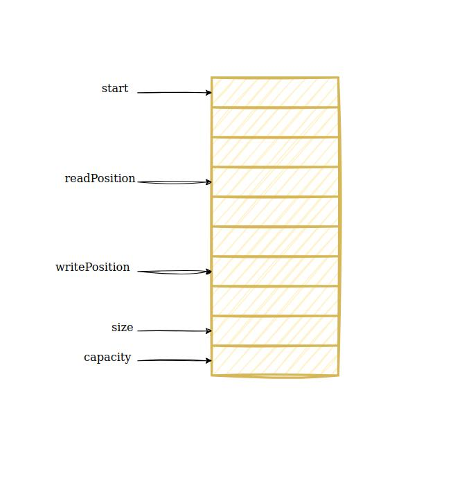

= ZarpBytes

:css-signature: demo
:toc: marco
:toclevels: 2
:icons: font

toc::[]
== Introduction

ZarpBytes is a comprehensive library which providing low-level memory access.
It is constructed and taken advantages of system call (OS).

In essence, ZarpBytes serves a similar purpose to Java's non-blocking I/O ByteBuffer (Java NIO).
The API offers:

* Support 63-bit size.
* Thread-safe operation for off-heap memory.
* Elastic buffer, which can grow on demand.

=== Support data types

The following table outlines the operations and data types supported by ZarpBytes:

|===
| Operation | Index/Stream | Binary
| read/write primitives | both | bool, byte, ubyte, short, ushort, int-24, uint-24, int, uint, long, float, double
| read/write others | both | byte[], ByteBuffer
| CAS | indexed | int, long
| volatile | indexed | int, long, float, double
| ordered | indexed | int, long
| peek | both | ubyte
| atomicity (addAndGet, ...) | indexed | int, long, float, double
|===

The following table show explanations for each operation supported:

|===
| read/write others | read and write of other data structure like (byte array, ByteBuffer)
| CAS, atomicity | an atomic compare-and-swap operation
| volatile | put/get the value of data type without OS caching (main memory)
| ordered | put the value of data type with memory barrier
| peek | retrieve the value of data type without modify its pointer position
|===

=== Understand ZBytes

A ZBytes buffer have the following properties:

* *start*: the smallest index in buffer, this is almost 0 in implementation, for memory-mapped file it is the offset
within file.
* *capacity*: the maximum possible capacity for buffer, which is usually 2GiB.
* *size*: the current size of buffer.
* *readLimit*: the maximum index that can be read from.
* *writeLimit*: the maximum index that can be written to.
* *readPosition*: the index from which value is read from.
* *writePosition*: the index at which value is written to.

[#image-buffer]

=== Understand ZByteStore

BytesStore is a block of memory with fixed size into which you can write data and read later.
